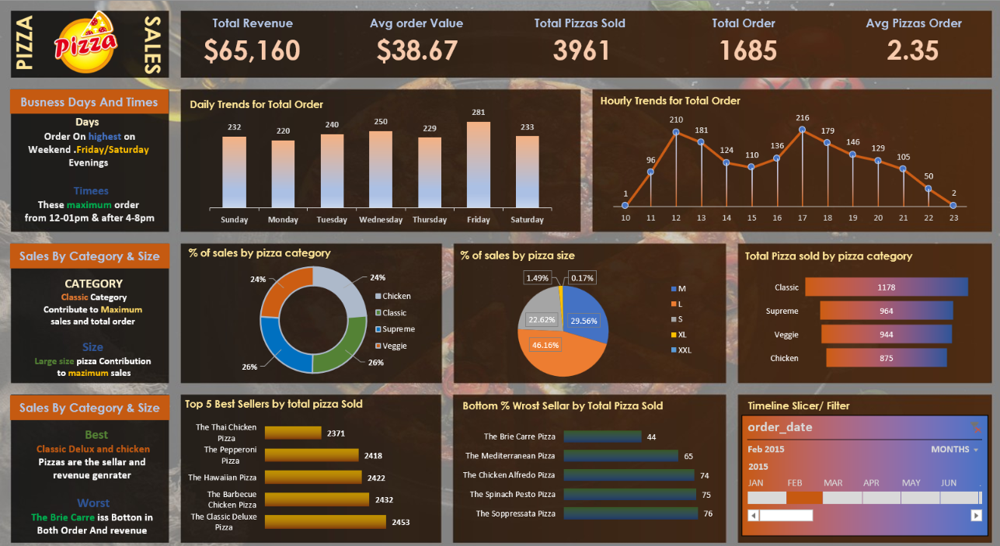
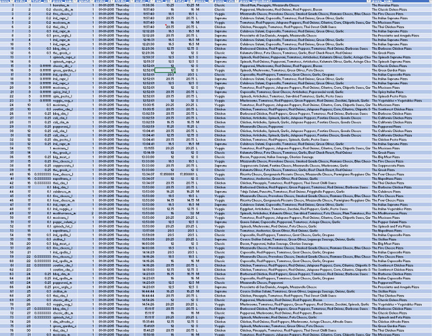

# 🍕 **Pizza Sales Performance & Analytics Dashboard**

An end-to-end **Data Analytics Project** featuring dataset processing and an interactive **Excel Dashboard** analyzing pizza sales trends, revenue drivers, customer order behaviors, and product performance.

---

## 🖼️ **Project Visuals**

### 1. **Interactive Excel Dashboard**


### 2. **Source Raw Data**


---

## 📋 **Table of Contents**
- [Project Overview](#-project-overview)
- [Dataset Column Titles & Data Dictionary](#-dataset-column-titles--data-dictionary)
- [Key Business Metrics (KPIs)](#-key-business-metrics-kpis)
- [Dashboard Insights & Key Takeaways](#-dashboard-insights--key-takeaways)
- [Project Structure & Files](#-project-structure--files)
- [How to Use / Installation](#-how-to-use--installation)

---

## 📊 **Project Overview**
This project processes raw pizza store order data to build a visual performance dashboard in **Microsoft Excel**. It enables management to track **daily** and **hourly traffic patterns**, identify **top/bottom selling pizzas**, measure sales distribution across **categories** and **sizes**, and filter trends dynamically using **timeline slicers**.

---

## 🏷️ **Dataset Column Titles & Data Dictionary**

Below are the **12 column headers** present in the source dataset (`Data_4.png` / `Excel-dashbord.xlsx`):

| Column Name | Data Type | Description |
| :--- | :--- | :--- |
| `pizza_id` | **Integer** | Unique identifier for each individual pizza line item in an order. |
| `order_id` | **Integer** | Unique identifier for the customer's overall order. |
| `quantity` | **Integer** | Quantity of the specific pizza ordered in that line item. |
| `order_date` | **Date** | Date when the order was placed (`DD-MM-YYYY`). |
| `order_time` | **Time** | Time when the order was placed (`HH:MM:SS`). |
| `unit_price` | **Decimal** | Price per single unit of the pizza (`$`). |
| `total_price` | **Decimal** | Total price calculated as `quantity * unit_price` (`$`). |
| `pizza_size` | **Text** | Size category (`S` = Small, `M` = Medium, `L` = Large, `XL`, `XXL`). |
| `pizza_category` | **Text** | Category group (`Classic`, `Supreme`, `Veggie`, `Chicken`). |
| `pizza_ingredients` | **Text** | Detailed list of ingredients included in the pizza. |
| `pizza_name` | **Text** | Full display name (e.g., *The Hawaiian Pizza*, *The Classic Deluxe Pizza*). |
| `pizza_name_id` | **Text** | Unique code identifier (e.g., `hawaiian_m`, `classic_dlx_s`). |

---

## 📈 **Key Business Metrics (KPIs)**

* **Total Revenue:** **`$65,160`**
* **Average Order Value (AOV):** **`$38.67`**
* **Total Pizzas Sold:** **`3,961`**
* **Total Orders:** **`1,685`**
* **Average Pizzas Per Order:** **`2.35`**

---

## 💡 **Dashboard Insights & Key Takeaways**

### 📅 **Order Trends by Day & Time**
* **Peak Days:** Highest order volume occurs on **Friday (281 orders)** and **Saturday (233 orders)**, particularly during **weekend evenings**.
* **Peak Hours:** Two primary traffic spikes occur during lunchtime (**12:00 PM – 1:00 PM**, ~210 orders) and dinnertime (**5:00 PM – 6:00 PM**, ~216 orders).

### 🍕 **Sales Breakdown by Category & Size**
* **Category Leader:** **Classic Category** contributes the highest overall sales revenue (**26%**) and volume sold (**1,178 pizzas**).
* **Size Leader:** **Large (L) size** pizzas drive the maximum sales contribution at **46.16%**, followed by **Medium (M)** at **29.56%**.

### 🏆 **Product Performance**
* **Top 5 Best Sellers:** 
  1. **The Classic Deluxe Pizza** (2,453 sold)
  2. **The Barbecue Chicken Pizza** (2,432 sold)
  3. **The Hawaiian Pizza** (2,422 sold)
  4. **The Pepperoni Pizza** (2,418 sold)
  5. **The Thai Chicken Pizza** (2,371 sold)
* **Bottom Seller:** **The Brie Carre Pizza** records the lowest performance in both order volume (**44 sold**) and overall revenue.

---

## 📁 **Project Structure & Files**

```text
├── Data_4.png               # Screenshot of the raw dataset
├── Dashboard-image_4.png    # Screenshot of the complete Excel dashboard
├── Excel-dashbord.xlsx      # Primary Excel workbook containing raw data, pivot tables, and visual dashboard
└── README.md                # Documentation file
